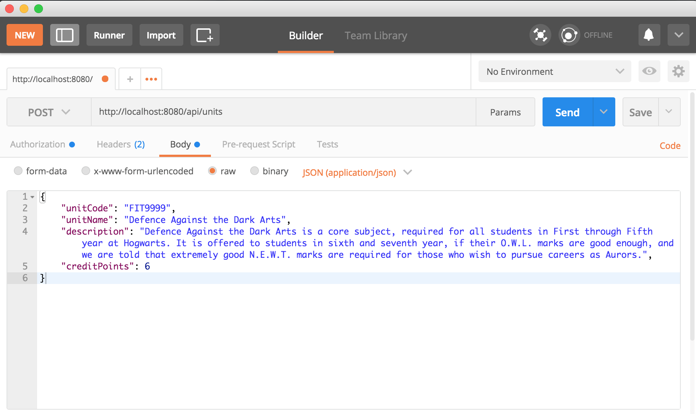
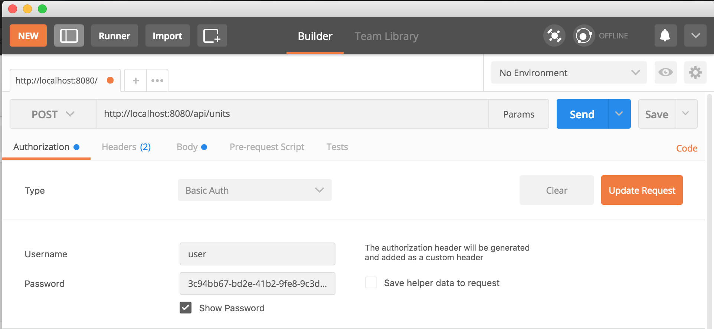
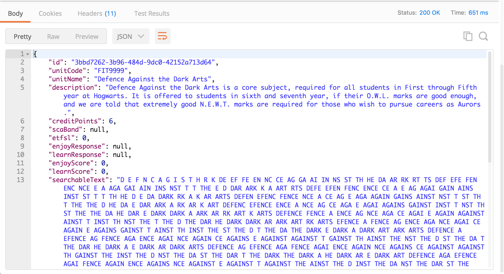
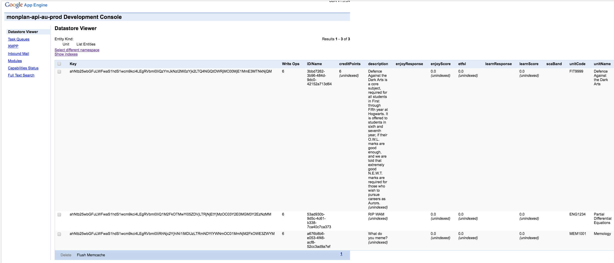

<p align="center">
  
</p>

<hr>

# Status
[](https://github.com/monPlan/AppleSeed)
[](https://github.com/monPlan/AppleSeed)
[](https://github.com/monPlan/AppleSeed)
[](https://github.com/monPlan/AppleSeed)
[](https://github.com/monPlan/AppleSeed)
[](https://github.com/monPlan/AppleSeed)

**Current Version**: [](https://github.com/monPlan/AppleSeed/releases/latest)

**Latest Pre-Release**: [](https://github.com/monPlan/AppleSeed/releases)

**Current Build Status**: 

# Why AppleSeed as the name?

Our Applet or App (APP-le, get it?) is the foundation of our code, it is designed around SpringBoot. We believe in letting you code on this framework will be awesome! :seedling: Seeds grow into a huge tree during the Spring :evergreen_tree:. 


# Introduction
This is the base for the API which is built on AppEngine Standard with Java 8 using SpringBoot.

You can also read more about developing on this [here](https://monplan.github.io/AppleSeed/#/) or jump to the [quick start](#quick-start) section

## Contributors
Thanks to 3wks for the gae-tool and spring-boot-gae modules

### Proudly Built by the [monPlan team](https://monplan.github.io)

## Contributing

Before contributing, please be sure that you have read our [Code of Conduct](https://github.com/monPlan/AppleSeed/tree/master/.github/CODE_OF_CONDUCT.md).

A setup guide can be found in our development guide, [here](https://monplan.github.io/AppleSeed/#/?id=getting-started).

## Available Tools:
- Custom Exceptions built on top of Springboot
- GAE Tools by [3wks](https://github.com/3wks)
- Swagger

## Quick Start
A quick guide to getting up and running asap locally.

### Table of Contents  
1. [Set up](#1-clone-project-and-open-in-intelliJ)  
2. [Running backend](#2-run-the-backend) 
3. [Accessing backend](#3-accessing-the-backend) 
4. [Posting data](#4-posting-data) 
5. [Getting data](#5-getting-data)
6. [Admin console](#6-admin-console)
### 1. Set up project and open in IntelliJ

Fork the project into your own repository and clone it. 

If IntelliJ prompts you to import resources from maven say yes

### 2. Run the backend

Run `mvn appengine:devserver` on command line in the project directory.
This will build the project and start the server. 

If successful your output will look something like this
```
[INFO] 
[INFO]   .   ____          _            __ _ _
[INFO]  /\\ / ___'_ __ _ _(_)_ __  __ _ \ \ \ \
[INFO] ( ( )\___ | '_ | '_| | '_ \/ _` | \ \ \ \
[INFO]  \\/  ___)| |_)| | | | | || (_| |  ) ) ) )
[INFO]   '  |____| .__|_| |_|_| |_\__, | / / / /
[INFO]  =========|_|==============|___/=/_/_/_/
[INFO]  :: Spring Boot ::        (v1.5.3.RELEASE)
[INFO] 
[INFO] 2017-11-16 22:44:47.351  INFO 32609 --- [           main] edu.monash.monplan.edu.monash.monplan.ServletInitializer    : Starting edu.monash.monplan.ServletInitializer on dyn-118-138-38-175.its.monash.edu.au with PID 32609 (/Users/David/Desktop/monPlan-repos/local/AppleSeed/target/springboot-base-gae-java8-1.0-SNAPSHOT/WEB-INF/lib/springboot-base-gae-java8-1.0-SNAPSHOT.jar started by David in /Users/David/Desktop/monPlan-repos/local/AppleSeed/target/springboot-base-gae-java8-1.0-SNAPSHOT)
[INFO] 2017-11-16 22:44:47.378  INFO 32609 --- [           main] edu.monash.monplan.edu.monash.monplan.ServletInitializer    : No active profile set, falling back to default profiles: default
[INFO] 2017-11-16 22:44:47.540  INFO 32609 --- [           main] ationConfigEmbeddedWebApplicationContext : Refreshing org.springframework.boot.context.embedded.AnnotationConfigEmbeddedWebApplicationContext@39a2bb97: startup date [Thu Nov 16 22:44:47 UTC 2017]; root of context hierarchy
....
[INFO] Using default security password: 3c94bb67-bd2e-41b2-9fe8-9c3d8c86ed54
[INFO] 
...
[INFO] Nov 16, 2017 10:44:56 PM com.google.appengine.tools.development.AbstractModule startup
[INFO] INFO: Module instance default is running at http://localhost:8080/
[INFO] Nov 16, 2017 10:44:56 PM com.google.appengine.tools.development.AbstractModule startup
[INFO] INFO: The admin console is running at http://localhost:8080/_ah/admin
[INFO] Nov 17, 2017 9:44:56 AM com.google.appengine.tools.development.DevAppServerImpl doStart
[INFO] INFO: Dev App Server is now running
```

The important things here are the:
- `security password`: You need this to get access to the application, in this case it is `3c94bb67-bd2e-41b2-9fe8-9c3d8c86ed54` 
- `port number`: This is the address of your service.

### 3. Accessing the backend

Going to `http://localhost:8080/` you will be prompted to authenticate, enter 'user' as the username and the security password for password.
Once you have authenticate you will see a `404 error` as the route has not been mapped.

### 4. Posting data

To post data to the backend use a tool like [Postman](https://www.getpostman.com/).
For example if I want to add a new unit I would do something like this.

**Setting body of POST request**

This needs to be [valid JSON](https://jsonlint.com/)



**Setting the authorization**

You make the request you need to include basic authorization, to do this in Postman go into the Authorization tab in the request and put in user and your security password.
 


**Response**

This is the expected response returning the created unit.


**How it works**

Spring will take the JSON in the request body and map the fields to attributes in [edu.monash.monplan.model.Unit](https://github.com/monPlan/AppleSeed/blob/master/src/main/java/edu/monash/monplan/model/Unit.java),
corresponding fields will be given the value in the JSON object, missing fields in `Unit` will be initialized to default values
(eg 0 for ints and doubles, null for Integer) and extra fields in the request body will be ignored.

Note: If you do not provide an `id` we will create one for you using `UUID`.

### 5. Getting data

To get data use HTTP GET on the endpoint. For example if I want to get unit data I would do a get to `http://localhost:8080/api/units`.

This can be done on the web browser or in Postman, if you are using Postman remember to include the authorization.


You can make requests for all CRUD (create, read, update, delete) functionality defined in controller classes. 

### 6. Admin console

Appending `_ah/admin` to your url you can access GAE's admin console allowing you to manipulate what is in your local datastore.

Eg you can list all units when you navigate to `http://localhost:8080/_ah/admin/datastore`


